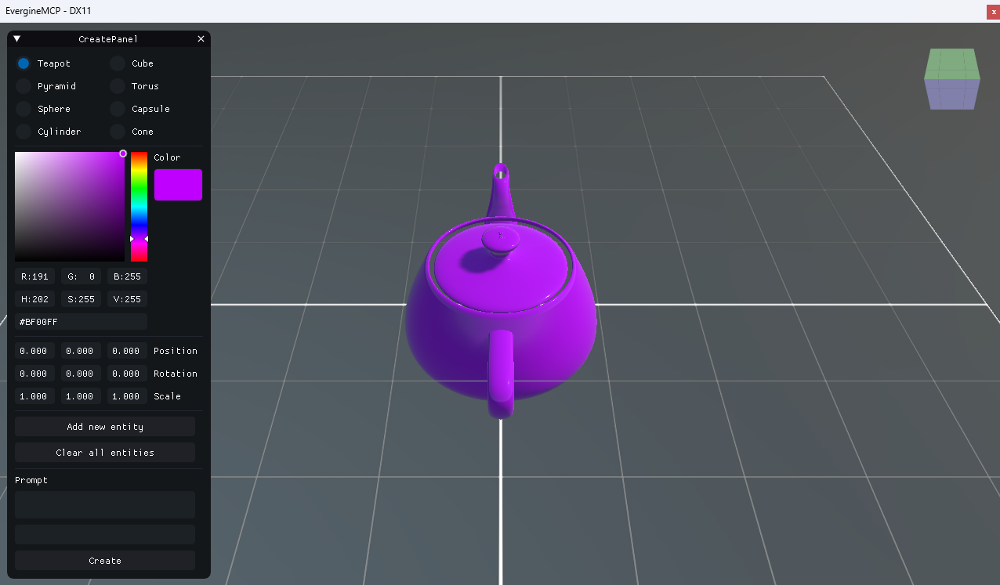
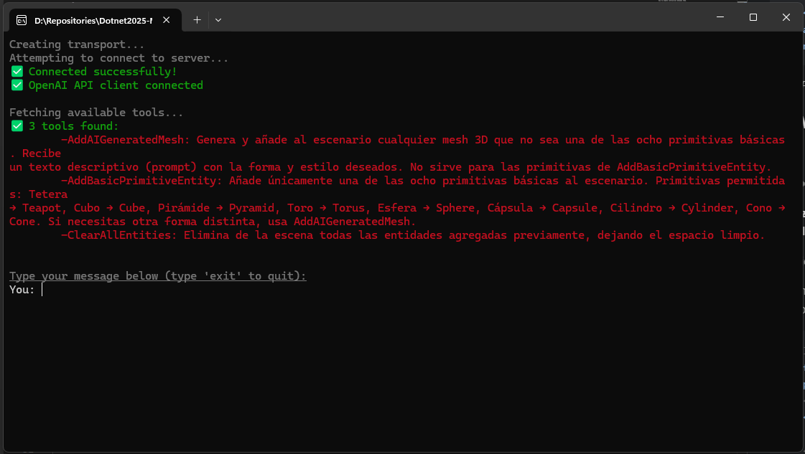

# DotNet2025 – Evergine MCP Demo

This repository contains the source code for the demos presented during the **DotNet 2025** event, held in **Madrid** and organized by **Plain Concepts** on **Thursday, June 19th**, by [Jorge Cantón](https://www.linkedin.com/in/jorgecanton/) and [Manuel Rodrigo Cabello](https://www.linkedin.com/in/rodrigocabello/).

The demo showcases the implementation of a **Model Context Protocol (MCP) Server** using the [Evergine](https://evergine.com) engine, as well as a console-based **MCP Client** powered by Large Language Models (LLMs). It demonstrates how to build both the server and client sides of MCP applications in **C#**, and how to enable interaction between them.

---

## 🎥 Watch the Conference Recording
[](https://www.youtube.com/watch?v=ID_DEL_VIDEO)

---

## 📁 Projects Included

### 🧠 MCP Server (Evergine-based)



This project launches a 3D scene using Evergine and exposes a set of tools via an MCP Server:

- 🧱 **Create basic 3D primitives** in the scene (cube, sphere, cylinder, etc.).
- 🧹 **Delete all previously added primitives** from the scene.
- 🤖 **Generate a 3D model using Generative AI** via [TripoAI](https://tripo.ai), with PBR materials applied.

The server reads its configuration from an `App.config` file. To enable TripoAI integration, you must provide a valid API key.

```xml
<?xml version="1.0" encoding="utf-8" ?>
<configuration>
  <appSettings>
    <!-- TripoAI settings -->
    <add key="tripo-key" value="[tsk_*****]" />
  </appSettings>
</configuration>
```
_Note. Replace [tsk_*****] with your actual TripoAI API key._

### 💬 MCP Client (Console-based)



This is a console application that connects to the MCP Server and allows interaction through an LLM-powered chat interface.

It supports two backends:

- **Azure OpenAI** (recommended for better comprehension and reasoning)
- **Ollama** (for running local models; configured for `llama3.2:3b`)

The client reads its configuration from a separate `App.config` file where you can specify:
- The path to the MCP Server executable (relative or absolute)
- Your Azure OpenAI API key, endpoint URL, and model deployment name

```xml
<?xml version="1.0" encoding="utf-8" ?>
<configuration>
  <appSettings>
    <!-- MCP Server executable path -->
    <add key="mcp-server" value="../../../../MCP-Server/EvergineMCPServer.Windows/bin/Debug/net8.0-windows/EvergineMCPServer.Windows.exe" />

    <!-- Azure OpenAI settings -->
    <add key="azure-openAi-apiKey" value="[openai-apikey]" />
    <add key="azure-openAi-apiUrl" value="[openai-apiurl]" />
    <add key="model-deployment-name" value="[openai-model-name]" />
  </appSettings>
</configuration>
```

During the **DotNet2025** event, we used **Azure OpenAI** due to its superior understanding and reliability, which we recommend for advanced or production scenarios.

---

## 🚀 Technologies Used

- 💻 **[Evergine](https://evergine.com)** – Real-time graphics engine  
- 🔌 **[Model Context Protocol (MCP)](https://modelcontextprotocol.io/introduction)**  
- 🧠 **Azure OpenAI** & **Ollama** for LLM integration  
- 🤖 **[TripoAI](https://platform.tripo3d.ai/docs/introduction)** for 3D model generation with PBR materials  
- 🟦 Fully implemented in **C#** using **.NET 8**

---

## 📚 Purpose

This project serves as a practical reference for:

- Building an **MCP Server** that exposes real-time 3D tools  
- Implementing an **MCP Client** that interacts with the server through LLMs  
- Establishing communication between server and client via MCP  
- Integrating **Generative AI** into a 3D application workflow

---

## 📝 License

This project is intended for demonstration and educational purposes.  
Please refer to individual tool and service licenses (e.g., Azure OpenAI, TripoAI) for their respective terms of use.
